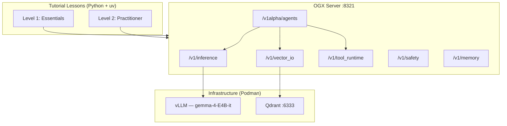

# OGX Tutorial

[](https://www.python.org/downloads/)
[](https://github.com/ogx-ai/ogx)
[](LICENSE)

> A hands-on, two-level tutorial for building AI applications with OGX (Open GenAI Stack) — inference, RAG, agents, tool calling, MCP, and safety through a single unified API.

OGX is an open-source AI runtime that provides standardized APIs across 23+ inference providers. This tutorial teaches you to build real AI applications — RAG pipelines, tool-calling agents, and MCP integrations — progressing from API essentials to production deployment patterns.

## Features

- **13 self-contained lessons** — each is a standalone `uv` project you can run independently
- **Two progressive levels** — Essentials (API fundamentals) and Practitioner (advanced patterns)
- **Full RAG pipeline** — document ingestion, vector search with Qdrant, and retrieval-augmented generation
- **Agent development** — OGX native agents, tool calling, and MCP integration
- **Production patterns** — multi-provider configuration, custom providers, containerized deployment
- **Infrastructure included** — Podman Compose brings up OGX + Qdrant in one command

## Architecture



## Quick Start

### Prerequisites

- Python 3.10+
- [uv](https://docs.astral.sh/uv/) package manager
- [Podman](https://podman.io/) (with Compose)
- ~4 GB disk for the Gemma 4 model

### 1. Clone the repository

```bash
git clone https://github.com/lukaskellerstein/ogx-tutorial.git
cd ogx-tutorial
```

### 2. Start infrastructure

```bash
cd ogx-local
podman compose up -d
```

This starts the OGX server and Qdrant. OGX takes 30-60 seconds to initialize.

> **Note:** The default setup uses Ollama as the inference backend (runs natively on the host). Pull the model first: `ollama pull gemma4:e4b`

### 3. Verify the setup

```bash
cd ogx-local
uv sync
uv run python main.py
```

### 4. Run your first lesson

```bash
cd tutorial/level_1/M1_fundamentals/1_architecture_overview
uv sync
uv run python main.py
```

## Usage

Every lesson follows the same pattern:

```bash
cd tutorial/<level>/<module>/<lesson>
uv sync
uv run python main.py
```

Each lesson's `main.py` connects to the OGX server at `http://localhost:8321` and prints step-by-step output to the console. The accompanying `README.md` in each lesson directory explains the concepts and expected output.

## Configuration

| Service | URL | Purpose |
|---------|-----|---------|
| OGX API | `http://localhost:8321` | Unified AI runtime |
| Qdrant | `http://localhost:6333` | Vector database |
| Qdrant Dashboard | `http://localhost:6333/dashboard` | Vector DB UI |
| Ollama | `http://localhost:11434` | Inference backend (host) |

Infrastructure is configured via `ogx-local/.env`:

| Variable | Description | Default |
|----------|-------------|---------|
| `OGX_IMAGE` | OGX container image | `ogxai/distribution-starter` |
| `QDRANT_VERSION` | Qdrant image tag | `latest` |
| `INFERENCE_MODEL` | Model for inference | `gemma4:e4b` |
| `OLLAMA_URL` | Ollama endpoint for OGX | `http://host.containers.internal:11434/v1` |

## Curriculum

### Level 1 — Essentials (~7-8 hours)

| Module | Lessons | Topics |
|--------|---------|--------|
| **M1: Fundamentals** | Architecture Overview, Installing & Running | OGX API surface, distributions, client setup |
| **M2: Inference API** | Chat Completion, Embeddings | Chat/text completions, streaming, embedding generation |
| **M3: RAG** | Vector IO API, RAG Application | Qdrant vector store, document ingestion, end-to-end RAG |
| **M4: Tool Calling & MCP** | Tool Runtime API | Custom tools, MCP server integration, built-in tools |
| **M5: Agents API** | Creating Agents, Agents with RAG | Agent lifecycle, multi-turn conversations, RAG-powered agents |
| **M6: Safety API** | Content Moderation | Input/output shields, safety detectors |

### Level 2 — Practitioner (~2.5-3 hours)

| Module | Lessons | Topics |
|--------|---------|--------|
| **M1: Advanced Patterns** | Multi-Provider Config, Custom Providers, Production Deployment | Provider routing, fallback chains, custom extensions, Podman Compose production stack |

See [`syllabus.md`](syllabus.md) for full lesson details, deliverables, and time estimates.

## Project Structure

```
ogx-tutorial/
├── ogx-local/              # Infrastructure: Podman Compose + verification script
│   ├── compose.yml          #   OGX + Qdrant services
│   ├── .env                 #   Container configuration
│   └── main.py              #   Setup verification script
├── syllabus.md              # Full course syllabus (source of truth)
└── tutorial/
    ├── level_1/             # Essentials: 10 lessons across 6 modules
    │   ├── M1_fundamentals/
    │   ├── M2_inference_api/
    │   ├── M3_rag/
    │   ├── M4_tool_calling_mcp/
    │   ├── M5_agents_api/
    │   └── M6_safety_api/
    └── level_2/             # Practitioner: 3 lessons in 1 module
        └── M1_advanced_patterns/
```

Each lesson directory contains:

| File | Purpose |
|------|---------|
| `main.py` | Working lesson code |
| `README.md` | Lesson guide with concepts and expected output |
| `pyproject.toml` | Standalone `uv` project with dependencies |
| `.gitignore` | Ignores `.venv/`, `__pycache__/` |

## Contributing

Contributions are welcome! Please follow these guidelines:

1. Fork the repository
2. Create your feature branch (`git checkout -b feature/new-lesson`)
3. Each lesson must be self-contained with `pyproject.toml`, `main.py`, `README.md`, and `.gitignore`
4. Test your lesson: `cd <lesson-dir> && uv sync && uv run python main.py`
5. Open a Pull Request
